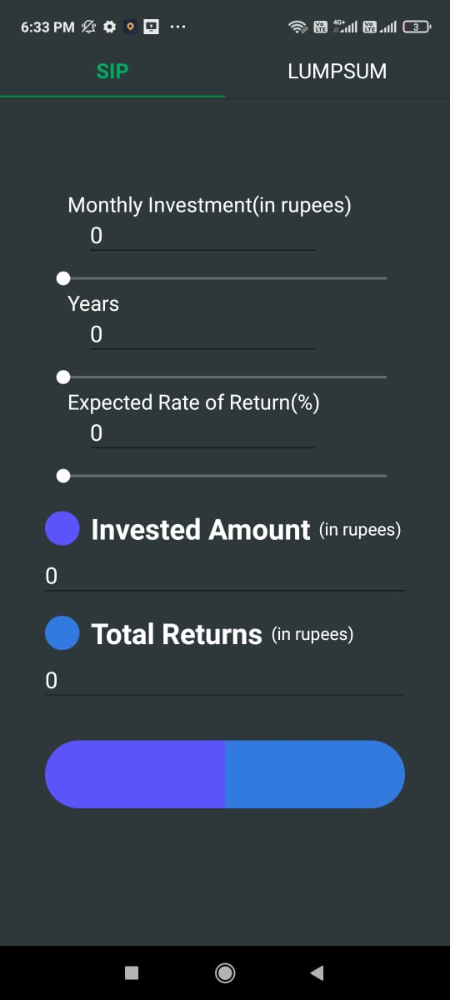
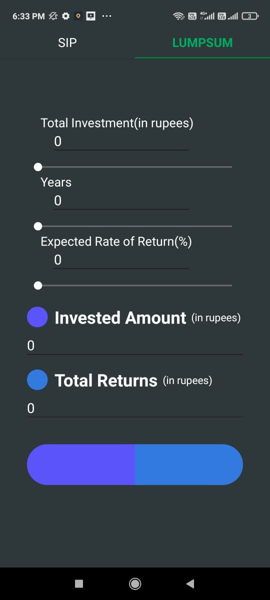

# InvestmentCalculator

Check it out on Google PlayStore [Link to App](https://play.google.com/store/apps/details?id=com.aaryavrat.InvestmentCalculator)

## About
An investment calulator that will calulate the resulting amount(based on investing strategy - SIP/Lumpsum) on your invested amount over a period of time with and expected rate of return

## Screenshots

  
  
  

## Usage
1. Select investment strategy (SIP/Lumpsum)
2. Enter amount to invest, time and rate of return
3. The result will be calculated and displayed 
4 The bar at the bottom is a ratio bar which will give you a pictorial representation of the ratio of invested money to the resultant amount.

## Technologies used
The app was built using React Native

